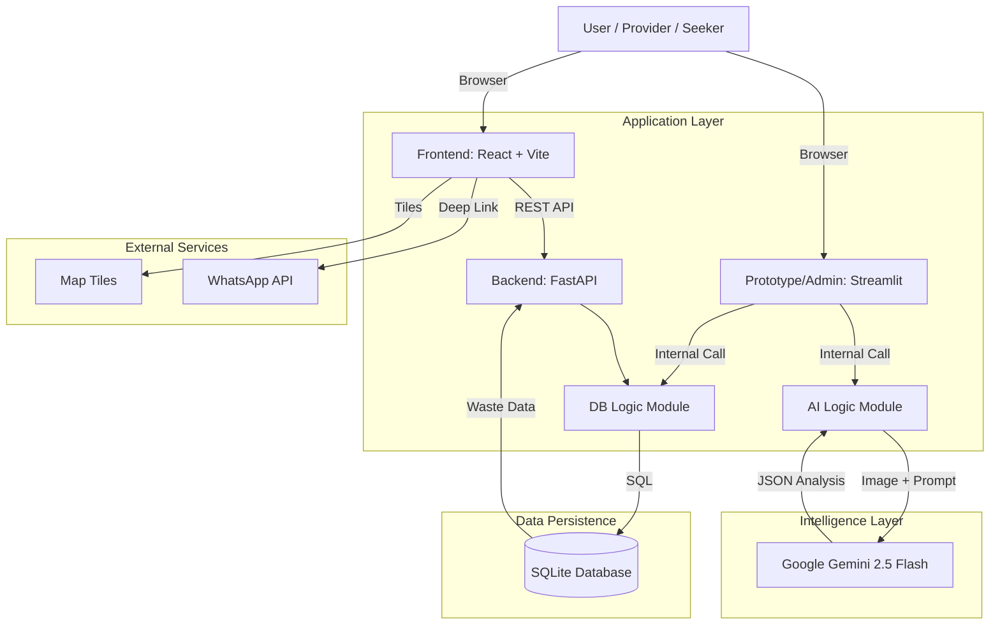

# 🏗️ EcoCycle ID - System Architecture

## 📌 TL;DR (Key Highlights for Pitch Deck)

*   **Hybrid Frontend Strategy:** Menggunakan **React + Vite** untuk *end-user experience* yang responsif dan **Streamlit** untuk *rapid prototyping & admin dashboard*.
*   **AI-First Core:** Didukung oleh **Google Gemini 2.5 Flash** (Multimodal) untuk analisis visual real-time (deteksi jenis sampah, estimasi berat, dan validasi organik).
*   **High-Performance Backend:** Menggunakan **FastAPI** (Asynchronous) sebagai gateway data yang efisien dan scalable.
*   **Privacy-Centric Geospatial:** Implementasi **Geohashing/Jittering** untuk melindungi privasi lokasi pengguna pada peta publik.
*   **Social Commerce Integration:** Integrasi *seamless* dengan **WhatsApp** untuk negosiasi dan transaksi antar pengguna.

---

## 1. High-Level Architecture Diagram

---

## 2. Component Breakdown

### A. Frontend Layer (The "Face")

Kami menggunakan strategi **Dual-Frontend** untuk kecepatan pengembangan dan skalabilitas user.

#### 1. User Client (React + Vite)
*   **Tech Stack:** TypeScript, React 18, Vite, Tailwind CSS.
*   **Peran:** Aplikasi utama untuk pengguna publik (Seeker/Pencari Pakan).
*   **Fitur Utama:**
    *   **Peta Interaktif:** Menggunakan `React-Leaflet` untuk rendering peta yang ringan dan cepat.
    *   **Dynamic Filtering:** Filter real-time berdasarkan kategori (Maggot, Kompos, Unggas).
    *   **Smart Popups:** Menampilkan detail sampah dan tombol "Hubungi via WA" yang membuat pesan template otomatis.
    *   **Auto-Focus:** Algoritma centroid untuk memusatkan peta secara otomatis ke area dengan densitas data tertinggi.

#### 2. Provider/Admin Interface (Streamlit)
*   **Tech Stack:** Python, Streamlit, Folium.
*   **Peran:** MVP untuk validasi ide cepat, interface untuk *Provider* mengupload foto, dan dashboard analitik.
*   **Fitur Utama:**
    *   **Direct AI Interface:** Upload foto langsung diproses ke *AI Engine*.
    *   **Location Jittering:** Algoritma pengacakan koordinat (±200m) saat data disimpan untuk privasi.

### B. Backend Layer (The "Bridge")

#### FastAPI Gateway (`api.py`)
*   **Tech Stack:** Python 3.13, FastAPI, Uvicorn.
*   **Arsitektur:** RESTful API, Asynchronous (ASGI).
*   **Fungsi:**
    *   Menyediakan endpoint `/waste_posts` untuk frontend React.
    *   Menangani **CORS (Cross-Origin Resource Sharing)** agar frontend dan backend bisa berkomunikasi dengan aman.
    *   **Data Serialization:** Mengubah data raw database menjadi format JSON yang bersih (menghapus data blob gambar berat sebelum dikirim ke peta).

### C. Intelligence Layer (The "Brain")

#### AI Analysis Engine (`ai_service.py`)
*   **Model:** **Google Gemini 2.5 Flash**.
*   **Alasan Pemilihan:** Latensi sangat rendah (Flash), kemampuan *multimodal* (bisa "melihat" gambar), dan *cost-effective* untuk skala besar.
*   **Prompt Engineering:** System prompt yang dirancang khusus untuk:
    1.  **Validasi:** Menolak gambar non-organik (laptop, mobil, wajah orang) dengan `is_organic_waste: false`.
    2.  **Estimasi:** Menghitung perkiraan berat (kg) dari volume visual.
    3.  **Rekomendasi:** Memberikan tag kecocokan (misal: "Cocok untuk Maggot BSF" vs "Cocok untuk Kompos").
    4.  **Safety:** Mendeteksi kontaminan berbahaya (plastik, logam).

### D. Data Layer (The "Memory")

#### Database (`ecocycle.db`)
*   **Current State:** SQLite.
*   **Struktur Data:**
    *   `waste_posts`: Menyimpan metadata sampah, koordinat (lat/lon), hasil analisis AI (JSON), dan timestamp.
    *   `image_blob`: Menyimpan bukti foto dalam format binary (BLOB) untuk verifikasi.
*   **Future Scalability Plan:** Arsitektur kode (`db.py`) menggunakan pola abstraksi, sehingga migrasi ke **PostgreSQL + PostGIS** (untuk query geospasial tingkat lanjut) dapat dilakukan tanpa mengubah logika aplikasi utama.

---

## 3. Data Flow (User Journey)

1.  **Input (Provider):** User mengupload foto sisa makanan via Streamlit.
2.  **Processing:**
    *   Gambar dikirim ke `ai_service`.
    *   Gemini 2.5 Flash memvalidasi & menganalisis.
    *   Jika Valid: Lokasi user dideteksi -> *Jittering Algorithm* diterapkan -> Data disimpan ke SQLite.
    *   Jika Invalid: Sistem menolak dan memberikan alasan.
3.  **Distribution (API):**
    *   React Client merequest data terbaru ke FastAPI (`GET /waste_posts`).
    *   FastAPI mengambil data dari SQLite, memfilter data sensitif, dan mengirim JSON.
4.  **Action (Seeker):**
    *   Seeker melihat marker di Peta (React).
    *   Klik marker -> Klik "Hubungi via WA".
    *   Sistem membuka WhatsApp dengan pesan pre-filled: *"Halo, saya tertarik dengan limbah Sayuran (5kg)..."*.

---

## 4. Security & Scalability Considerations

*   **Privacy by Design:** Koordinat asli tidak pernah ditampilkan di peta publik (hanya *jittered location*).
*   **Modular Codebase:** Pemisahan jelas antara UI (`ui/`), API (`api.py`), Logic (`ai_service.py`), dan Data (`db.py`) memudahkan maintenance dan testing.
*   **Error Handling:** Validasi AI mencegah "sampah data" (spam/foto tidak relevan) masuk ke dalam sistem.

---

*Dokumen ini dibuat untuk keperluan Pitch Deck EcoCycle ID - ITB Hackathon 2025.*
