# 🔄 EcoCycle ID - System Pipelines

Dokumen ini menjelaskan secara detail alur kerja (pipeline) data, pemrosesan AI, interaksi pengguna, dan pengembangan sistem EcoCycle ID. Dokumen ini dirancang untuk memberikan gambaran teknis operasional kepada investor dan tim teknis.

---

## 📌 Ringkasan Eksekutif

Sistem EcoCycle ID beroperasi melalui **tiga pipeline utama**:
1.  **Data Ingestion & Intelligence:** Dari upload foto hingga validasi AI dan penyimpanan database.
2.  **Privacy & Geospatial:** Pengamanan data lokasi pengguna sebelum disimpan.
3.  **Distribution & Transaction:** Distribusi data real-time ke peta dan konversi ke transaksi sosial (WhatsApp).

---

## 1. Core Data Pipeline (Dari Foto ke Database)

Alur ini menangani bagaimana data sampah masuk, divalidasi, dan disimpan.

```mermaid
sequenceDiagram
    participant P as Provider (Streamlit)
    participant L as Logic Layer (Python)
    participant AI as Gemini 2.5 Flash
    participant DB as SQLite Database

    P->>L: Upload Raw Image (JPG/PNG)
    L->>L: Convert Image to Bytes
    L->>AI: Send Image + System Prompt
    
    Note over AI: AI Analysis Process
    AI->>AI: Computer Vision (Identify Objects)
    AI->>AI: Check "is_organic_waste"
    AI->>AI: Estimate Weight (kg)
    AI->>AI: Generate Handling Tips
    
    AI-->>L: Return JSON Result
    
    alt is_organic_waste == FALSE
        L-->>P: ❌ Error: "Foto ditolak (Bukan Organik)"
    else is_organic_waste == TRUE
        L->>P: ✅ Show Preview & Analysis
        P->>L: Confirm Location (Browser GPS)
        L->>L: Apply Location Jittering (Privacy)
        L->>DB: Insert Row (Metadata + Jittered Lat/Lon)
        DB-->>L: Success (Post ID)
        L-->>P: 🎉 Success Notification
    end
```

### Detail Teknis:
1.  **Input Validasi:** Sistem tidak menerima file non-gambar.
2.  **AI Gatekeeper:** Logic `is_organic_waste` bertindak sebagai filter spam otomatis. Foto laptop, mobil, atau selfie akan ditolak sebelum masuk database.
3.  **Data Structuring:** Output AI yang tidak terstruktur (teks) dipaksa menjadi JSON schema yang ketat agar bisa di-query.

---

## 2. Privacy & Geospatial Pipeline

Mekanisme perlindungan privasi adalah fitur kunci untuk keamanan pengguna rumah tangga.

**Flow:**
1.  **Raw GPS Capture:** Browser mengambil koordinat presisi pengguna (contoh: `-6.2000, 106.8500`).
2.  **Jittering Algorithm (Python):**
    *   Input: `lat`, `lon`, `radius_meter=200`.
    *   Process: Menambahkan offset random menggunakan kalkulasi trigonometri bumi.
    *   Output: `safe_lat`, `safe_lon` (contoh: `-6.2015, 106.8520`).
3.  **Storage:** Hanya `safe_lat` dan `safe_lon` yang disimpan ke database. Koordinat asli **dibuang** dari memori RAM segera setelah pemrosesan.
4.  **Visualization:** Peta menampilkan area perkiraan, bukan pintu rumah spesifik.

---

## 3. Distribution Pipeline (Frontend & API)

Bagaimana data sampai ke layar Pencari (Seeker) secara real-time.

### Optimasi Performa:
*   **Binary Stripping:** API secara eksplisit menghapus field `image_blob` (yang berukuran besar) sebelum mengirim respon JSON ke React. Ini mengurangi ukuran payload dari ~2MB/request menjadi ~2KB/request (1000x lebih ringan).
*   **CORS Policy:** Middleware keamanan yang dikonfigurasi untuk hanya mengizinkan request dari frontend yang sah (localhost/production domain).

---

## 4. Transaction Pipeline (Social Commerce)

EcoCycle ID tidak menahan uang pengguna (Escrow), melainkan memfasilitasi koneksi peer-to-peer langsung (P2P).

1.  **Trigger:** User klik tombol "Hubungi via WA" di popup peta.
2.  **Payload Assembly (React):**
    *   Mengambil data post: `Kategori`, `Berat`, `Provider Type`.
    *   Mengambil nomor tujuan: `6285388156854`.
3.  **Deep Linking:**
    *   Membangun URL: `https://wa.me/{phone}?text={encoded_message}`.
    *   Contoh Pesan Otomatis: *"Halo, saya tertarik dengan limbah Sayur (5kg) dari Restoran. Apakah masih tersedia?"*
4.  **Handover:** Browser membuka aplikasi WhatsApp Desktop/Mobile. Transaksi dan negosiasi terjadi di luar platform (Off-Platform Settlement).

---

## 5. CI/CD & Deployment Pipeline (Roadmap)

Rencana pengembangan dari Local Development menuju Production Cloud.

### A. Local Development (Current Status)
*   **Code:** Python (Backend/AI) & TypeScript (Frontend).
*   **Linting:** ESLint (TS) & Pylint (Py).
*   **Run:** `uvicorn api:app` (Port 8000) + `npm run dev` (Port 5173).

### B. Production Pipeline (Target Q1 2025)
1.  **Commit:** Developer push code ke GitHub.
2.  **Test:** GitHub Actions menjalankan `pytest` (Backend logic) dan `npm run build` (Frontend build check).
3.  **Containerization:**
    *   Backend dipaketkan ke **Docker Image** (Python Slim).
    *   Frontend dipaketkan ke static assets (Nginx/Vercel).
4.  **Deploy:**
    *   Backend -> **Google Cloud Run** (Serverless, Scale to Zero).
    *   Database -> **Google Cloud SQL** (PostgreSQL) atau **Supabase**.
    *   Frontend -> **Vercel** / **Netlify**.

---

*Dokumen ini diperbarui terakhir pada: 26 November 2025.*
